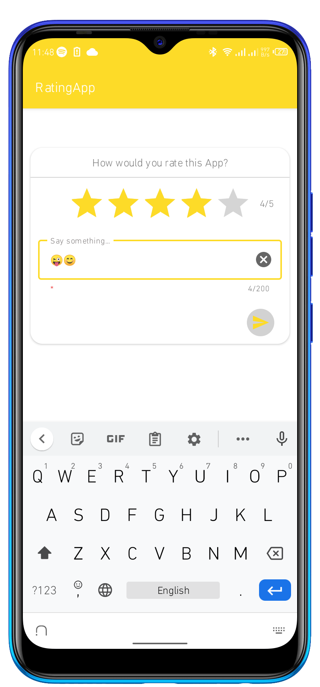
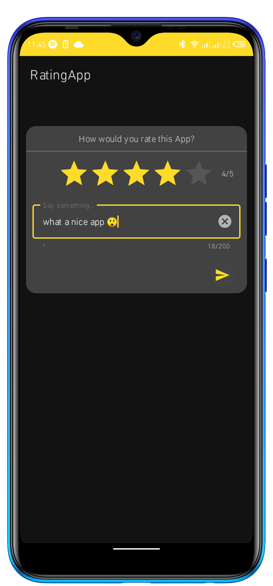

# RatingApp

## Image preview

*****
### The preview image on light-mode

<!-- using github user content is cool but including app images in the app is even better 😎-->
<!-- something else worth noting is that Android Studio prefers PNG to other image formats especially
 when generating a signed APK. I'd suggest using PNG as much as possible even when you don't need an APK -->

******
### The preview image on dark-mode

